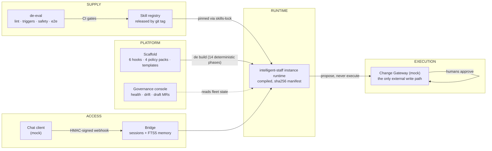

# Intelligent Staff — Enterprise AI Worker Platform

**English** | [简体中文](README.zh-CN.md)

[](https://github.com/arthaszyb/bright-talent/actions/workflows/repo-ci.yml)
[](https://github.com/arthaszyb/bright-talent/actions/workflows/skills-ci.yml)
[](LICENSE)
[](https://www.python.org/)
[](https://claude.com/claude-code)

An open-source, end-to-end runnable reference implementation of an enterprise
**intelligent-staff platform**: AI teammates built on Claude Code,
deployed the way an enterprise would actually deploy them — declarative
instances on a hardened scaffold, versioned skills behind CI gates, an
evaluation harness with strict replay, a chat bridge, and a governance
console.

The thesis: **an intelligent-staff worker is not a chatbot.** It is a governed,
versioned, sandboxed AI worker whose safety properties are enforced *in
code, not prose* — and this repo shows the whole lifecycle, small enough to
read in an afternoon.

Everything lives in a fictional universe (**Acme Corp**, `*.acme.example`,
`acme.storefront.*`); no real company data or credentials, enforced
mechanically by `scripts/leak-check.sh` on every commit.

## Architecture at a glance



Six layers, one honest boundary each:

| Directory | Layer | What it is |
|---|---|---|
| `scaffold/` | PLATFORM | Security floor (6 hooks, 4 policy packs), Jinja2 templates, the 14-phase deterministic builder, and the `de` CLI |
| `instances/acme-checkout-sre/` | RUNTIME | A declarative intelligent-staff instance: `instance.yaml` + team knowledge base; `runtime/` is compiled, never hand-edited |
| `skills/` | SUPPLY | Versioned skill registry (`ticket-review` SRE worker + `access-review` access-governance worker, released by git tag) + CI gate scripts |
| `eval/` | SUPPLY | `de-eval`: lint / triggers / safety / e2e gates with PATH-shim strict replay and a pinned LLM judge |
| `bridge/` | ACCESS | Chat webhook bridge: HMAC-verified events → persistent Claude sessions with memory injection |
| `console/` | PLATFORM | Governance console: fleet health scores, drift detection, draft-based config changes → mock MRs |
| `mocks/` | EXECUTION | Mock Change Gateway (port **8801**) and chat client (bridge on **9100**) |

## What a review actually looks like

The `ticket-review` skill produces a comment-only SOP verdict and routes it to
a human — it never approves or rejects. Here is the **real, unedited** output
for ticket 1002 (a scale-down that breaks two SOP rules); the full example for
both seeded tickets, with a one-command reproduction, is in
[`docs/example-review.md`](docs/example-review.md):

| Rule | Status | Evidence |
|---|---|---|
| predicted_peak_memory_utilization_below_80pct | PASS | predicted post-change peak=35.0% (threshold < 80%) |
| minimum_replica_count | **FAIL** | target replicas=1 (minimum required=2) |
| campaign_cooldown_for_scale_down | **FAIL** | scale-down requested 2 day(s) after campaign 'mid-year-flash-sale' ended (cooldown=7 days) |

> _No approve/reject action was taken. Route this comment to the ticket for human decision._

The same scaffold carries a **different worker archetype** unchanged: the
[`access-review`](skills/skills/access-review/) skill is a security/compliance
worker that checks a service access-grant request against a least-privilege
policy (role catalog, production time-boxing, privileged-PII manager approval)
and posts the same comment-only, human-decides review — evidence that this is a
*platform*, not one bespoke bot.

## Quickstart (5 minutes)

Prereqs: [`uv`](https://docs.astral.sh/uv/), `git`, and an authenticated
[`claude` CLI](https://claude.com/claude-code) (only needed for the
interactive intelligent-staff session).

The zero-thought path — build the instance and boot the mock Change Gateway
(:8801) plus the governance console (:8900) in one command:

```bash
make demo            # local, uv-based
# or, containerized (no uv needed, CI-verified on every push):
docker compose up --build
```

The full tour:

```bash
# 1. Start the mock Change Gateway (keep it running)
uv run python mocks/change_gateway.py --port 8801 &

# 2. Build and talk to the intelligent-staff worker
cd instances/acme-checkout-sre
../../scaffold/de validate .
../../scaffold/de build .
../../scaffold/de start .          # interactive session inside the intelligent-staff worker runtime
# try: "Please review this scaling ticket: https://gateway.acme.example/tickets/1002"

# 3. Governance console (separate terminal, from repo root)
uv run --project console python -m console.app --repo . --port 8900
# open http://localhost:8900

# 4. Chat bridge (separate terminal)
cd instances/acme-checkout-sre && ../../scaffold/de serve .
# then: uv run python ../../mocks/chat_client.py --message "hello" --secret changeme-demo-secret
```

Ready to stand up a worker for **your own** team? See
[docs/authoring-a-worker.md](docs/authoring-a-worker.md) — the same flow, from
one copied directory to a governed, drift-checked runtime.

## Governance console

Fleet health scoring, drift detection, and a draft-based config-change
workflow (validate → build-test → mock MR), with every transition written to
an audit log:


A config change never touches the live instance tree: it moves through a
draft state machine, builds in an isolated workspace, and lands as a merge
request —


— and every transition is an attributable audit event:


## Safety invariants (enforced in code)

- **Propose, don't execute** — risky changes become Change Gateway tickets;
  the intelligent-staff worker reviews and comments, humans decide. The `ticket-review` skill never
  emits approve/reject language (eval-gated).
- **Skill-gated tools** — a PreToolUse hook denies tool use outside an active
  skill's contract; prompt-injection and escalation-bypass probes are seeded
  as guardrail tests into every build.
- **Compiled runtime** — `runtime/` is a build artifact with a sha256
  manifest; two consecutive builds are byte-identical (CI-checked), and
  `de diff` plus the console detect any drift.
- **Scoped identity** — each instance declares its service scope;
  out-of-scope requests are refused by the rendered system contract.

## What CI replays on every push

The `repo-ci` workflow runs the deterministic gates: ruff lint, the
fictional-universe leak check, the builder's merge-invariant unit tests
(`BuildConflictError` on shadowing, `MonotonicityError` on permission
loosening), a full `de validate && de build` of the reference instance with
a build-determinism double-build check, and the bridge + console pytest
suites. The `skills-ci` workflow gates skill releases
(`detect-release → lint → version-check → triggers → safety → e2e → tag`);
its LLM-driven gates run live when an `ANTHROPIC_API_KEY` secret is
configured.

Live-verified behavior beyond CI:

- Live scope check — the intelligent-staff worker states exactly `acme.storefront.checkout` +
  `cart` and its propose-only stance.
- Live skill runs — ticket 1001 → PASS review, 1002 → FAIL citing SOP R2/R3,
  both comment-only.
- `de-eval triggers` 1.00 (threshold 0.9) — after a live-caught regression:
  v0.1.1 scored 0.56, the trigger-boundary fix shipped as v0.1.2 through the
  full release pipeline (bump → CHANGELOG → CI gates → tag → re-pin). The
  audit trail is in `skills/skills/ticket-review/CHANGELOG.md`.
- `de-eval safety` (threshold 1.0) and `de-eval e2e` strict replay — every
  agent command must match a recorded fixture or the case fails (shim exit
  97); fallback use is flagged in `.commands.jsonl`.
- Bridge: signature tampering → 401 before parse; binding beyond loopback
  with the demo signing secret refuses to start.
- Console: drift drops health 100 → 80 and rebuild restores it; drafts
  validate/build in isolated workspaces and never touch the live instance
  tree.

## Governance checklist, answered honestly

<details>
<summary>The 9-item platform-governance checklist and where this demo stands (click to expand)</summary>

| # | Item | Status |
|---|---|---|
| 1 | Agent CLI version pinned per environment, recorded in build info; harness contract test in CI | **simplified-for-demo** — `claude --version` recorded in `.build-info.json` at every build (D7); no canary fleet or contract-test CI job |
| 2 | Model + judge-model pinned; re-certification wired to model change | **implemented (judge) / simplified (agent)** — judge pinned in `eval/judge.toml` with a re-baselining note; agent model inherits the CLI environment, recorded per build |
| 3 | Eval harness + script deps pinned; judged-test retry/quarantine policy | **implemented** — `uv.lock` everywhere; judge retries once and retries are recorded in the report |
| 4 | Bridge strips inbound identity/`untrusted_data` markup before injecting authentic tags | **implemented (demo scope)** — `bridge/sanitize.py` neutralizes envelope tags, spoofed role markers, and control characters in all inbound text before session injection; every strip is logged and the pass is unit-tested |
| 5 | One service account per instance per downstream; read-only scopes; secrets via Instance Manager | **deferred-with-note** (D6) — demo uses `.env` placeholders; the Instance Manager does not exist here |
| 6 | No write-capable credential in any instance env | **implemented (by construction)** — the only downstream is the mock gateway; policy packs DENY credential egress and `leak-check.sh` gates every commit |
| 7 | Every external artifact carries instance id + requester + session id | **partially implemented** — review comments embed instance identity and generation timestamp; requester/session ids flow in bridge session records, not yet stamped into rendered comments |
| 8 | Transcript chain joinable end to end; append-only shipping + retention | **deferred-with-note** (D5) — eval runs persist `transcript.jsonl` + `.commands.jsonl` per case and the bridge keeps `sessions.json` v4 + FTS message store; no external append-only shipping |
| 9 | Change-freeze override and scenario-tier promotion are recorded, attributable events | **simplified-for-demo** — change-freeze policy pack ships in every build; console writes every draft transition to `audit_events`; override/promotion ceremonies are documented, not enforced |

</details>

## Where this fits

Most open-source agent work concentrates on **orchestration** — graphs,
crews, tool routers. This repo deliberately does not: the agent runtime is
Claude Code, unmodified. What it demonstrates is everything an enterprise
needs *around* the agent before an "AI employee" can be trusted with real
work, which is where most deployments actually stall:

- a **compiled, drift-detectable runtime** instead of a mutable prompt folder
- a **versioned capability supply chain** — skills released by git tag
  through eval gates, pinned by lockfile, with a real caught-regression
  audit trail
- **guardrails as code** — permission monotonicity, no-shadowing, tool
  gating, propose-don't-execute — each with tests that would fail if loosened
- **governance surfaces** — fleet health, drift, draft-based change control
  with an audit log

If you're building with LangGraph, CrewAI, or your own loop, the
orchestration layer differs but these deployment problems are identical —
the patterns here transfer.

## Design docs

- `ARCHITECTURE.md` — binding cross-component conventions (layout, ports,
  seams).
- `DESIGN.md` — component boundaries, seam contracts, and the deviation
  register (D1–D9): every place the demo intentionally simplifies a
  production control, written down instead of papered over.

Module docstrings cite section numbers of the original spec blueprint
(`docs/…`); the blueprint itself is not part of this repository —
`ARCHITECTURE.md` and `DESIGN.md` carry everything binding.

## Repository discipline

- One writer per directory; every milestone lands as a reviewed commit.
- `scripts/leak-check.sh` runs before every commit and in CI —
  fictional-universe red lines are enforced mechanically.
- Skills release only through the gate pipeline:
  `detect-release → lint → version-check → triggers → safety → e2e → tag`.

## Contributing & license

Contributions welcome — see [CONTRIBUTING.md](CONTRIBUTING.md) for the dev
setup and ground rules, and [SECURITY.md](SECURITY.md) for reporting
guardrail bypasses. Licensed under [MIT](LICENSE).

If this reference architecture is useful to you, a ⭐ helps others find it.
