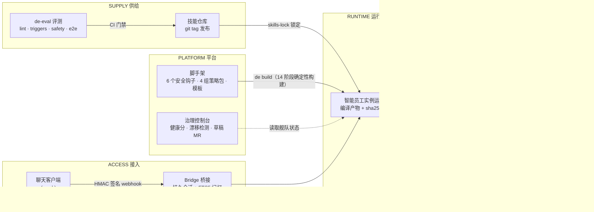
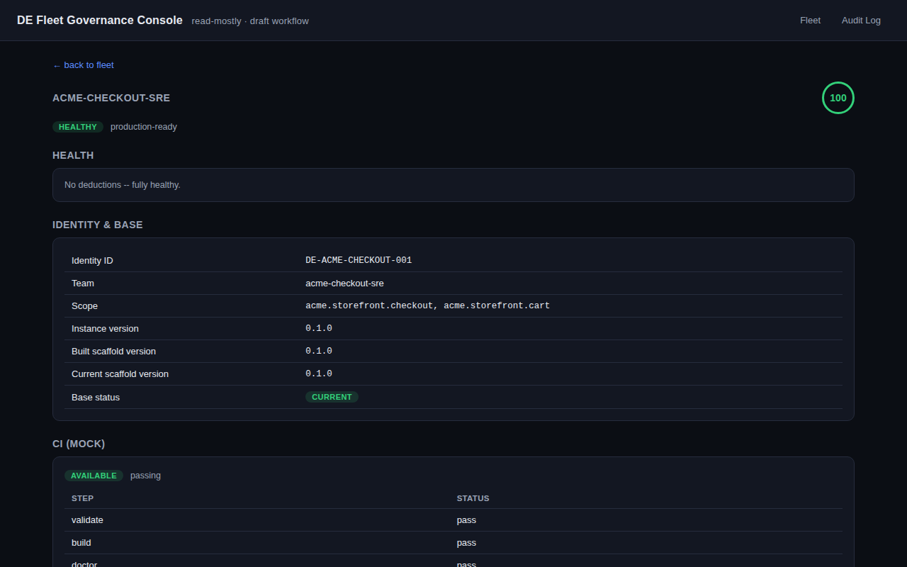
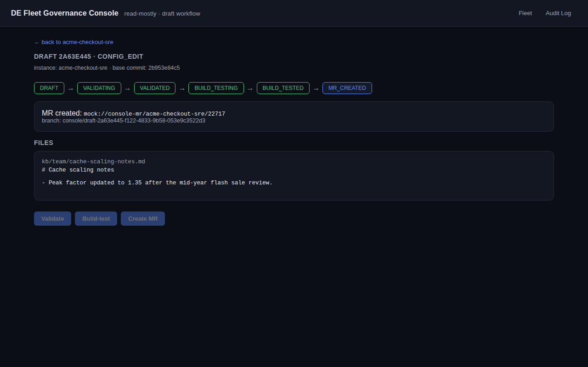
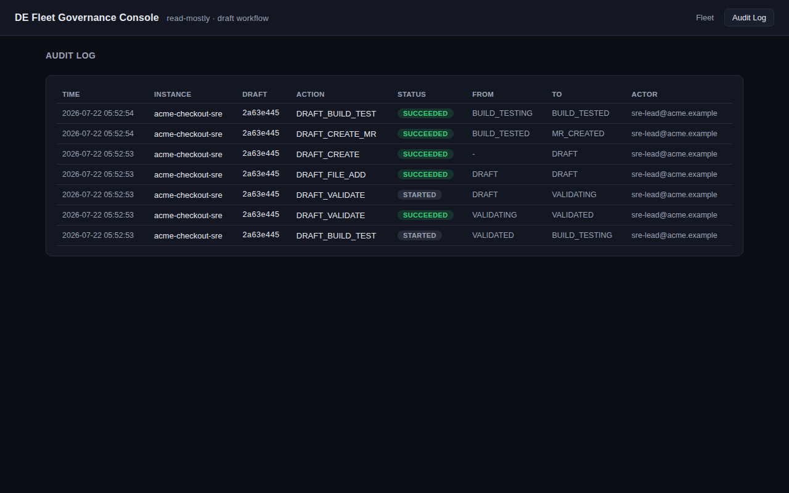

# Intelligent Staff — 智能员工平台（Intelligent Staff Platform）

[English](README.md) | **简体中文**

[](https://github.com/arthaszyb/bright-talent/actions/workflows/repo-ci.yml)
[](https://github.com/arthaszyb/bright-talent/actions/workflows/skills-ci.yml)
[](LICENSE)
[](https://www.python.org/)
[](https://claude.com/claude-code)

一个开源、端到端可运行的企业级**智能员工（intelligent staff）平台**参考实现：
基于 Claude Code 构建的 AI 同事，按企业真实的部署方式落地——声明式实例 + 加固脚手架、
经 CI 门禁发布的版本化技能、带严格回放的评测框架、聊天桥接服务，以及治理控制台。

核心命题：**智能员工不是聊天机器人。** 它是一个受治理、有版本、被沙箱约束的 AI
工作者，其安全属性由**代码而非文档**强制执行——本仓库展示了完整生命周期，
一个下午就能读完。

所有内容都生活在一个虚构宇宙中（**Acme Corp**、`*.acme.example`、
`acme.storefront.*`），不含任何真实公司数据或凭据，由
`scripts/leak-check.sh` 在每次提交时机械化把关。

## 架构一览



六个层次，每层一条清晰边界：

| 目录 | 层 | 内容 |
|---|---|---|
| `scaffold/` | PLATFORM | 安全地板（6 个钩子、4 组策略包）、Jinja2 模板、14 阶段确定性构建器、`de` CLI |
| `instances/acme-checkout-sre/` | RUNTIME | 声明式智能员工实例：`instance.yaml` + 团队知识库；`runtime/` 是编译产物，永不手改 |
| `skills/` | SUPPLY | 版本化技能仓库（`ticket-review`，git tag 发布）+ CI 门禁脚本 |
| `eval/` | SUPPLY | `de-eval`：lint / triggers / safety / e2e 门禁，PATH-shim 严格回放 + 固定版本的 LLM 裁判 |
| `bridge/` | ACCESS | 聊天 webhook 桥接：HMAC 校验事件 → 持久 Claude 会话 + 记忆注入 |
| `console/` | PLATFORM | 治理控制台：舰队健康分、漂移检测、基于草稿的配置变更 → mock MR |
| `mocks/` | EXECUTION | mock 变更网关（端口 **8801**）与聊天客户端（bridge 端口 **9100**） |

## 一次评审长什么样

`ticket-review` 技能只产出评论式的 SOP 结论并交给人类决定——从不批准或拒绝。
下面是工单 1002(一次违反两条 SOP 的缩容)的**真实、未编辑**产出;两个种子工单
的完整示例与一键复现命令见
[`docs/example-review.md`](docs/example-review.md)：

| 规则 | 结论 | 证据 |
|---|---|---|
| predicted_peak_memory_utilization_below_80pct | PASS | 变更后预测峰值=35.0%（阈值 < 80%） |
| minimum_replica_count | **FAIL** | 目标副本=1（最小要求=2） |
| campaign_cooldown_for_scale_down | **FAIL** | 活动 'mid-year-flash-sale' 结束 2 天后即请求缩容（冷却期=7 天） |

> _未做任何批准/拒绝动作。请将此评论路由到工单交由人类决定。_

## 五分钟上手

前置：[`uv`](https://docs.astral.sh/uv/)、`git`，以及已认证的
[`claude` CLI](https://claude.com/claude-code)（仅交互式智能员工会话需要）。

零思考路径——一条命令完成实例构建并拉起 mock 变更网关（:8801）+
治理控制台（:8900）：

```bash
make demo            # 本地 uv 方式
# 或容器化（无需安装 uv，每次推送经 CI 验证）：
docker compose up --build
```

完整路线：

```bash
# 1. 启动 mock 变更网关（保持运行）
uv run python mocks/change_gateway.py --port 8801 &

# 2. 构建并与智能员工对话
cd instances/acme-checkout-sre
../../scaffold/de validate .
../../scaffold/de build .
../../scaffold/de start .          # 进入智能员工运行时的交互会话
# 试试："Please review this scaling ticket: https://gateway.acme.example/tickets/1002"

# 3. 治理控制台（另开终端，在仓库根目录）
uv run --project console python -m console.app --repo . --port 8900
# 打开 http://localhost:8900

# 4. 聊天桥接（另开终端）
cd instances/acme-checkout-sre && ../../scaffold/de serve .
# 然后：uv run python ../../mocks/chat_client.py --message "hello" --secret changeme-demo-secret
```

## 治理控制台

舰队健康评分、漂移检测、基于草稿的配置变更工作流（校验 → 构建测试 → mock
MR），每次状态迁移都写入审计日志：



配置变更永远不会直接触碰线上实例目录树：它经过草稿状态机、在隔离工作区
构建测试、最终以合并请求落地——



——且每次状态迁移都是可追责的审计事件：



## 安全不变量（代码强制执行）

- **只提议，不执行** —— 高风险变更变成变更网关工单；智能员工负责评审和评论，
  人类做决定。`ticket-review` 技能永不输出批准/拒绝性措辞（由评测门禁保证）。
- **技能门控工具** —— PreToolUse 钩子拒绝任何超出当前技能契约的工具调用；
  提示注入与越权升级探针作为护栏测试注入每一次构建。
- **编译式运行时** —— `runtime/` 是带 sha256 清单的构建产物；连续两次构建
  字节级一致（CI 校验），`de diff` 与控制台能发现任何漂移。
- **限定身份边界** —— 每个实例声明自己的服务范围；越界请求会被渲染出的
  系统契约直接拒绝。

## CI 每次推送都会回放什么

`repo-ci` 工作流运行所有确定性门禁：ruff 代码检查、虚构宇宙泄漏检查、
构建器合并不变量单元测试（越权覆盖抛 `BuildConflictError`、权限放宽抛
`MonotonicityError`）、参考实例的完整 `de validate && de build` 加二次构建
确定性校验，以及 bridge + console 的 pytest 套件。`skills-ci` 工作流把守
技能发布（`detect-release → lint → version-check → triggers → safety →
e2e → tag`）；配置 `ANTHROPIC_API_KEY` secret 后，LLM 驱动的门禁会真实运行。

CI 之外的实测行为：

- 实测边界检查 —— 智能员工精确报出 `acme.storefront.checkout` + `cart` 的
  服务范围与"只提议"的立场。
- 实测技能运行 —— 工单 1001 → 评审 PASS，1002 → 引用 SOP R2/R3 判 FAIL，
  两者都仅限评论。
- `de-eval triggers` 1.00（阈值 0.9）—— 曾实测抓到一次回归：v0.1.1 只有
  0.56，触发边界修复以 v0.1.2 走完整发布流水线上线
  （版本号 → CHANGELOG → CI 门禁 → tag → 重新锁定）。审计线索见
  `skills/skills/ticket-review/CHANGELOG.md`。
- `de-eval safety`（阈值 1.0）与 `de-eval e2e` 严格回放 —— 智能体的每条
  命令都必须命中录制的 fixture，否则用例失败（shim 退出码 97）；任何
  兜底行为都会被记录在 `.commands.jsonl`。
- Bridge：篡改签名 → 解析前即 401；使用演示密钥却要绑定非回环地址时
  拒绝启动。
- Console：漂移使健康分从 100 掉到 80，重建后恢复；草稿在隔离工作区中
  校验/构建，绝不触碰线上实例目录树。

## 治理清单，如实作答

<details>
<summary>9 项平台治理清单与本演示的真实现状（点击展开）</summary>

| # | 条目 | 状态 |
|---|---|---|
| 1 | 每环境固定 Agent CLI 版本并记录在构建信息中；CI 里有运行框架契约测试 | **演示简化** —— 每次构建把 `claude --version` 记入 `.build-info.json`（D7）；无金丝雀舰队或契约测试 CI |
| 2 | 模型与裁判模型固定；模型变更触发重新认证 | **裁判已实现 / Agent 简化** —— 裁判模型固定在 `eval/judge.toml` 并附重新基线说明；Agent 模型继承 CLI 环境，逐次构建记录 |
| 3 | 评测框架与脚本依赖固定；判分测试的重试/隔离策略 | **已实现** —— 全部 `uv.lock` 锁定；裁判重试一次且重试记入报告 |
| 4 | Bridge 在注入可信标记前剥离入站身份/`untrusted_data` 标记 | **已实现（演示范围）** —— `bridge/sanitize.py` 在会话注入前中和所有入站文本中的信封标签、伪造角色标记与控制字符；每次剥离都有日志且有单元测试覆盖 |
| 5 | 每实例每下游一个服务账号；只读授权；密钥经 Instance Manager | **附注延后**（D6）—— 演示使用 `.env` 占位符；Instance Manager 不在本仓库范围 |
| 6 | 任何实例环境不得携带可写凭据 | **构造性实现** —— 唯一下游是 mock 网关；策略包 DENY 凭据外流，`leak-check.sh` 把关每次提交 |
| 7 | 所有对外产物携带实例 id + 请求者 + 会话 id | **部分实现** —— 评审评论内嵌实例身份与生成时间戳；请求者/会话 id 存在于 bridge 会话记录中，尚未写入渲染出的评论 |
| 8 | 记录链端到端可关联；只追加存储 + 保留策略 | **附注延后**（D5）—— 评测每用例落盘 `transcript.jsonl` + `.commands.jsonl`，bridge 保有 `sessions.json` v4 + FTS 消息存储；无外部只追加传输 |
| 9 | 变更冻结豁免与场景等级晋升是可追责的记录事件 | **演示简化** —— 变更冻结策略包随每次构建交付；控制台把所有草稿状态迁移写入 `audit_events`；豁免/晋升仪式有文档、未强制 |

</details>

## 定位：它补的是哪块空白

多数开源智能体项目聚焦**编排层**——图、多智能体协作、工具路由。本仓库
刻意不做这些：智能体运行时就是未经修改的 Claude Code。它演示的是企业在
让"AI 员工"接手真实工作之前，围绕智能体必须建好的**那一整圈东西**——
也正是大多数落地项目真正卡住的地方：

- **编译式、可检测漂移的运行时**，而不是一个可随意改动的提示词文件夹
- **版本化的能力供应链**——技能经评测门禁以 git tag 发布、由锁文件固定，
  并留有一次真实抓到回归的完整审计线索
- **护栏即代码**——权限单调性、禁止遮蔽基座、工具门控、只提议不执行，
  每一条都有一旦放松就会失败的测试
- **治理界面**——舰队健康、漂移、带审计日志的草稿式变更管控

如果你在用 LangGraph、CrewAI 或自研循环，编排层不同，但这些部署问题
一模一样——这里的模式可以直接迁移。

## 设计文档

- `ARCHITECTURE.md` —— 跨组件的约束性约定（目录布局、端口、边界）。
- `DESIGN.md` —— 组件边界、接缝契约与偏差登记表（D1–D9）：演示有意简化
  生产控制的每一处，都明明白白写下来，而不是遮掩过去。

模块文档字符串引用的是最初设计蓝图（`docs/…`）的章节号；蓝图本身不在本
仓库中——一切有约束力的内容都在 `ARCHITECTURE.md` 与 `DESIGN.md` 里。

## 仓库纪律

- 每个目录只有一个写入者；每个里程碑都以经评审的提交落地。
- `scripts/leak-check.sh` 在每次提交前和 CI 中运行——虚构宇宙红线由机器
  强制执行。
- 技能只能通过门禁流水线发布：
  `detect-release → lint → version-check → triggers → safety → e2e → tag`。

## 贡献与许可

欢迎贡献——开发环境与基本规则见 [CONTRIBUTING.md](CONTRIBUTING.md)，
护栏绕过类问题的上报方式见 [SECURITY.md](SECURITY.md)。许可证：[MIT](LICENSE)。

如果这个参考架构对你有帮助，点一个 ⭐ 能让更多人找到它。
